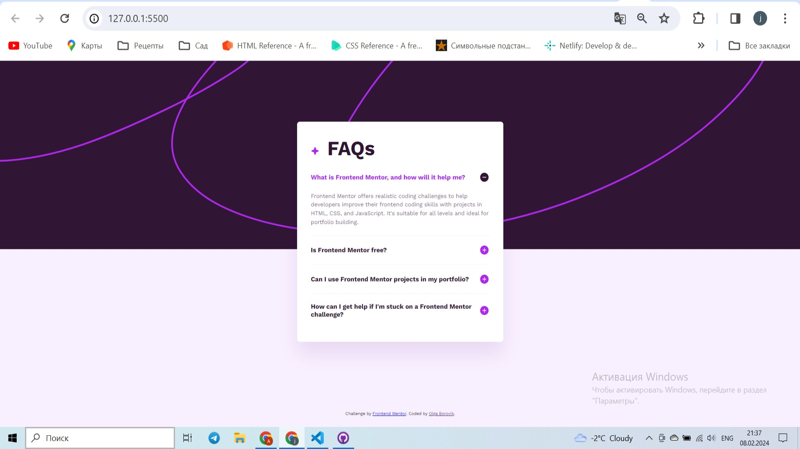

# Frontend Mentor - FAQ accordion solution

This is a solution to the [FAQ accordion challenge on Frontend Mentor](https://www.frontendmentor.io/challenges/faq-accordion-wyfFdeBwBz). Frontend Mentor challenges help you improve your coding skills by building realistic projects. 

### The challenge

Users should be able to:

- Hide/Show the answer to a question when the question is clicked
- Navigate the questions and hide/show answers using keyboard navigation alone
- View the optimal layout for the interface depending on their device's screen size
- See hover and focus states for all interactive elements on the page

### Screenshot

### Links

- Solution URL: https://github.com/OlgaBorovik/frontendmentor-FAQ-accordion
- Live Site URL: https://olgaborovik.github.io/frontendmentor-FAQ-accordion/

## My process

### Built with

- Semantic HTML5 markup
- CSS custom properties
- Flexbox
- Mobile-first workflow

### Useful resources

- https://developer.mozilla.org/en-US/docs/Web/HTML/Element/details - I used the details> HTML element for creating a disclosure widget.

## Author

- Frontend Mentor - https://www.frontendmentor.io/profile/OlgaBorovik

